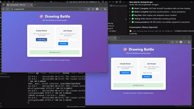

# 🎨 Draw Battles Online - Real-Time Collaborative Drawing Game

## 🎉 MILESTONE ACHIEVEMENT: Week 1-2 MVP Completed! 

**We've successfully implemented the core foundation of Draw Battles Online!** 

### 📹 Demo Video
> **Week 1-2 Milestone Demo** - See the real-time collaborative drawing in action!



*📁 Full HD video available at: [`docs/Week_1-2_Milestone_Demo.mp4`](docs/Week_1-2_Milestone_Demo.mp4)*

### ✅ Completed Features (Weeks 1-2)
- **Real-time collaborative drawing** with WebSocket synchronization
- **Room management system** with unique 6-character codes
- **Canvas state persistence** - new players see existing drawings
- **Cross-platform support** - desktop and mobile touch drawing
- **Professional UI/UX** with responsive design
- **Drawing tools** - brush size control, color picker, quick colors
- **Multi-player support** with live player tracking

---

## 🎯 Project Overview

Draw Battles Online is a real-time multiplayer drawing game where players compete by drawing prompts within time limits. Built with Flask-SocketIO for seamless real-time collaboration.

### 🚀 Tech Stack
- **Backend**: Python Flask + SocketIO with eventlet
- **Frontend**: HTML5 Canvas + JavaScript + CSS3
- **Real-time**: WebSocket connections via Socket.IO
- **Styling**: Modern CSS with mobile-first responsive design

## 🎮 How to Play

1. **Create or Join Room**: Use 6-character room codes
2. **Real-time Drawing**: Draw collaboratively on shared canvas
3. **Coming Soon**: Drawing prompts, scoring, and competitive battles!

## 🛠️ Development Setup

### Prerequisites
- Python 3.8+
- pip package manager

### Installation
```bash
# Clone the repository
git clone https://github.com/your-username/draw-battles-online.git
cd draw-battles-online

# Install dependencies
pip install -r requirements.txt

# Run the application
python app.py
```

### Access the Game
- Open your browser to `http://localhost:5000`
- Create a room or join with a room code
- Start drawing collaboratively!

## 📁 Project Structure

```
draw-battles-online/
├── app.py                 # Flask-SocketIO server with room management
├── templates/
│   ├── index.html        # Welcome screen with room controls
│   └── room.html         # Drawing room interface
├── static/
│   ├── css/style.css     # Responsive styling and UI design
│   └── js/drawing.js     # Canvas drawing logic and WebSocket integration
├── docs/                 # Project documentation and demos
├── chat-history/         # Development session logs
└── game/                 # Game logic modules (future expansion)
```

## 🔧 Core Features Implemented

### Real-Time Synchronization
- **Drawing strokes** broadcast instantly between players
- **Canvas state persistence** for new joiners
- **WebSocket event handling** for seamless collaboration

### Drawing Tools
- **Brush size control** with visual slider
- **Color picker** with quick color buttons
- **Canvas clearing** synchronized across all players
- **Touch support** for mobile devices

### Room Management
- **Unique room codes** (6-character alphanumeric)
- **Player tracking** with join/leave notifications
- **Active room monitoring** with automatic cleanup

## 🚧 Development Roadmap

### ✅ Phase 1: Foundation (Weeks 1-2) - COMPLETED
- Flask-SocketIO server setup
- Basic drawing and real-time sync
- Room management system
- Canvas state persistence

### 🔄 Phase 2: Game Mechanics (Week 3) - IN PROGRESS
- Drawing prompts system
- Turn-based gameplay
- Scoring and voting system
- Timer functionality

### 📋 Phase 3: Advanced Features (Week 4+)
- User accounts and profiles
- Matchmaking system
- Tournament modes
- Advanced drawing tools

## 🧪 Testing

The application has been extensively tested with:
- **Multi-window testing** for real-time synchronization
- **Mobile touch testing** for cross-platform compatibility
- **Canvas state testing** with multiple players joining/leaving
- **Server load testing** with WebSocket connections

## 📊 Technical Achievements

- **Zero-lag drawing** synchronization
- **Scalable room architecture** supporting multiple concurrent games
- **Mobile-responsive design** with touch gesture support
- **Robust error handling** and connection management
- **Efficient canvas state management** with stroke-by-stroke persistence

## 🤝 Contributing

1. Fork the repository
2. Create a feature branch (`git checkout -b feature/amazing-feature`)
3. Test your changes thoroughly
4. Commit with descriptive messages
5. Push to your branch and create a Pull Request

## 📝 Documentation

- **Product Requirements**: [`docs/PRD-drawing-battle-game.md`](docs/PRD-drawing-battle-game.md)
- **Development Plan**: [`docs/Phase1-Development-Plan.md`](docs/Phase1-Development-Plan.md)
- **Session Logs**: [`chat-history/`](chat-history/) - Detailed development session records

## 🏆 Recent Achievements

**Latest Session (Week 1-2 Implementation):**
- Implemented complete Flask-SocketIO foundation
- Built real-time drawing synchronization
- Added canvas state persistence for new joiners
- Created responsive mobile-friendly UI
- Fixed critical navigation and slider bugs
- Conducted extensive multi-player testing

**Next Session Goal**: Implement Week 3 game mechanics (prompts, scoring, turns)

---

**🎨 Ready to draw some battles? Let's create some art together! 🚀**
